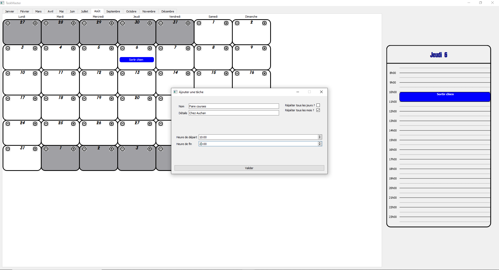

# TaskManager

Librairies requises :
PyQT5

Pour faire fonctionner le programme :
- Lancer le fichier global_functions.py pour générer le fichier json

- Lancer le programme en cliquant sur TaskManager_V0.0.py

